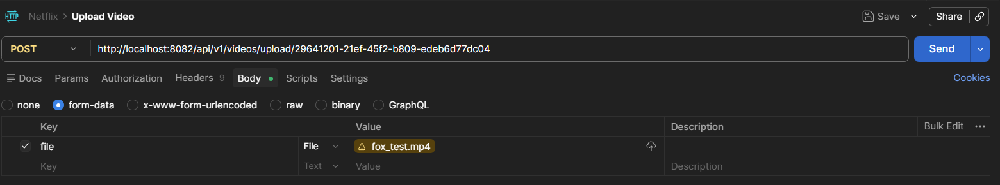

## How To Run
### Step 1: Start Infrastructure
```bash
docker-compose up -d
```
This starts Redis, MySQL, Zookeeper, and Kafka.

Wait 30 seconds for Kafka to fully start before running services.

### Step 2: Start Content Service
```bash
cd content-service
mvn spring-boot:run
```

### Step 3: Start Video Service
```bash
cd video-service
mvn spring-boot:run
```

### Step 4: Start Encoding Service
```bash
cd encoding-service
mvn spring-boot:run
```

### Step 5: Start Streaming Service
```bash
cd streaming-service
mvn spring-boot:run
```

---

## Testing End-to-End Flow

### Step 1: Add Movie (Content Service)
```
POST http://localhost:8081/api/v1/movies
{
    "title":"Test movie",
    "description":"A mind bending thriller",
    "genre":"DRAMA",
    "director":"Khaw",
    "cast":"Danq",
    "releaseYear":2026,
    "rating":7.2,
    "thumbnailUrl":"test-movie-thumbail-url.com",
    "durationMinutes":127
}

```

### Step 2: Upload video to S3 (Video Service --> Content Service --> Streaming Service --> Content Service)
```
POST http://localhost:8082/api/v1/videos/upload/{movieId}
```


### Step 3: Check Movie Status
```
GET http://localhost:8081/api/v1/movies/{movieId}
```
If the upload is successful, then the video status will be READY.

### Step 4: Get streaming URL for a movie
```
GET http://localhost:8084/api/v1/stream/{movieId}
```

---

## Verify in Redis CLI
```bash
docker exec -it redis-netflix redis-cli

# See all keys
keys *

# Retrieve a specific value
get <key_name>

# Get keys
mget key1 key2 key3

# Watch ttl
ttl <key_name>

```